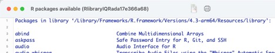
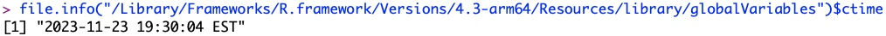
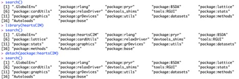
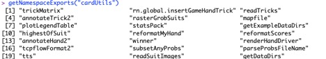
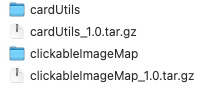
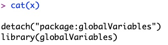
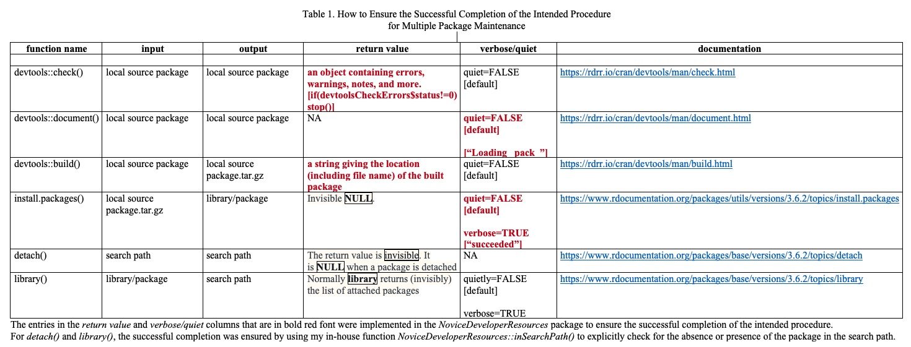
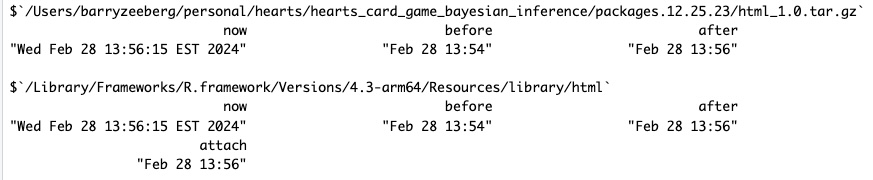
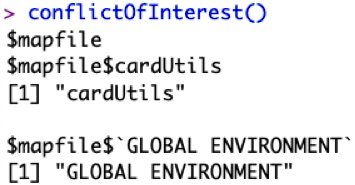

<b style='mso-bidi-font-weight:
normal'><o:p>&nbsp;</o:p></b>

<b style='mso-bidi-font-weight:
normal'><o:p>&nbsp;</o:p></b>

<b style='mso-bidi-font-weight:
normal'>Barry
Zeeberg<o:p></o:p></b>

<b style='mso-bidi-font-weight:
normal'>barryz2013@gmail.com<o:p></o:p></b>
 

<o:p>&nbsp;</o:p>

**MOTIVATION**

This is a short manual that I wish I had when I was trying to figure out
how to get started, and how to continue. The vocabulary that more
experienced developers use has terminology that is not that helpful to
an uninitiated novice. And there are several types of objects that
reside in various obscure places on your computer, and a collection of
commands to view or operate on these objects. Finally, the commands can
be issued from 4 different places: The UNIX terminal window (*e.g.,* on
Macintosh computers), the R Console window, the R Studio menus, or the R
Studio console. I will focus here on operating and navigating within the
R Console window, which can be considered to be necessary and
sufficient.

**BASIC COMMANDS**

A *package* is a unified integrated set of functions and objects that
can be installed by users of R. A few of these automatically come along
with the R program, but the others must be *installed* (usually from the
*CRAN repository*, which you can browse through to find the package that
you seek) by issuing

**install.packages("package-name")**

The collection of your installed packages is called a *library*,
residing in *e.g.,*
/Library/Frameworks/R.framework/Versions/4.3-arm64/Resources/library.
All of your installed packages can be viewed by issuing

**library()**

The output (Figure 1) can be a very long list, if you have been doing
this for a while, and is printed out in a separate window, presumably to
avoid cluttering up the main R Console window.

Figure 1. Output of library() command.

You can confirm that you have in fact successfully installed the package
into the library by checking that it has the expected creation time (Figure 1a).
I mention this because I have had problems replacing an older version of the
package with the newer version when using the R Studio "Clean and Install"
button. Fortunately this problem does not occur with
*checkBuildInstallSourcePackage()* (see below).

{width=100%}

Figure 1a. Creation time of installed package in the library

The installed libraries are not directly available for your use, until
you have *attached* them or (in different words for the same thing)
*loaded* them to your *search* path. Here we encounter the confusing
syntax: you attach a package by issuing

**library(package-name)**

It would make more sense for the command to be something like
*attach(package-name)*, since, as just discussed above, library() has a
completely different meaning, and the opposite command is

**detach(package:package-name)**

which removes the package from the search path.

To make matters even more confusing, the argument to *install.packages()* is the *"package-name"* in quotation marks; the argument to *library()* is the *package-name* with or without quotation marks; and the argument to *detach()* is the form of the package-name that appears as the output of *search()*, which is like *package:package-name* with or without quotation marks!

You can confirm that you have successfully loaded or removed the package
by issuing

**search()**

which shows what is attached to your search path (Figure 2).

Figure 2. Output of search(), library(), and detach() commands.

The functions within the loaded packages are available for you to access
and use in your own R code or program. The names of these functions can
be found by issuing (Figure 3)

**getNamespaceExports("package-name")**

Figure 3. Output of getNamespaceExports() command.

I mentioned above that packages can be installed on your computer by
download from the CRAN repository. If you develop your own package, then
you may want to eventually submit it to CRAN. But before you submit it,
you need to do two things:

First, you need to build a .tar.gz *source package*, which is the format
that is required for uploading to CRAN. That can be accomplished by

**setwd(p) \# p is the pathname to your package**

**devtools::document(roclets = c(\'rd\', \'collate\', \'namespace\',
\'vignette\'))**

**b\<-devtools::build()**

The resulting .tar.gz source package will be located in the same
directory as that containing your package (Figure 4). The returned
parameter *b* is the path name for the .tar.gz source package.

Figure 4. Location of .tar.gz source package

Second, in order to use or test the functions within the source package,
you need to install the source package on your computer from your local directory (in
contrast to installing it from CRAN). That can be accomplished by

**install.packages(b,repos=NULL,type=\'source\')**

where b is the path name for the .tar.gz source package that had been
returned by *b\<-devtools::build()* in the previous example.

**INTEGRATED SYSTEM checkBuildInstallSourcePackage()**

The several commands in the sequence to take package folders containing
your raw R program file to a functional package attached to your search
path are not too tedious to execute once or twice. But if you are
developing a set of inter-related packages, and you need to fine tune
them, the process can become quite repetitive, confusing, and tedious.
To facilitate this, within the *NoviceDeveloperResources* package I have
provided the function

**x<-checkBuildInstallSourcePackage(dir,packs,packCheck,autoLibrary)**

where *dir* is a character string containing the path name of the
directory holding the package folders, *packs* is a character vector
of the names of the packages, *packCheck* is a character vector
of the names of the packages (within *packs*) to subject to *check()*,
and *autoLibrary* is a Boolean discussed just below.

The parameter *packCheck* allows the user to speed up the development process by
specifying a subset of *packs* to subject to the rather lengthy *check()*. Of course, 
when the final packages are to be processed, *packCheck* should include all of *packs*. 

The return value x contains a character vector that can be viewed in the proper
format by

**cat(x)**

The output is shown in Figure 5. These lines can be copied and pasted into the
R Console to load the current version of the packages into the search path. This
is offered as an alternative to inclusion in the *checkBuildInstallSourcePackage()*
function, as it is [not permitted to automate code that can alter the user's search
path](https://stackoverflow.com/questions/64737686/why-library-or-require-should-not-be-used-in-a-r-package).

Figure 5. Output of cat(x)

There is a workaround to the safer (albeit more tredious) *cat(x)* procedure. If the Boolean parameter *autoLibrary* is set to TRUE, then we can bypass *cat(x)* and automate the *detach()* and *library()* procedures, by generating those commands using the *eval(parse())* mechanism. This essentially tricks R Studio into not recognizing that we are indirectly generating the forbidden *library()* call.

If you are running *checkBuildInstallSourcePackage()*
because you modified a certain package, then *packs* should include the name of
that package as well as any other packages which *import()* that package. Otherwise
those other packages may remain linked to the obsoleted version of that package. Furthermore, the names of these packages in the input list *packs* must be in the correct order so that the upper level packages *import()* the new version of the leaf node packages, rather than simply once again *import()* the obsolete version. This could be figured out manually, but the process is tedious and error-prone.

My related CRAN package *NoviceDeveloperResources2* contains an integrated program *sortedInputForCheckBuildInstallSourcePackageDriver()* to invoke *checkBuildInstallSourcePackage()* with the package names in the correct order within *packs*, as well as to check for conflicts, as discussed in the immediately following section.

**COMPREHENSIVE ERROR DETECTION AND REPORTING**

Comprehensive error detection and reporting were implemented for the 6 functions named in Table 1.This was generally based upon the return value of the function, or warnings generated by the functions (see the bolded red tables entries). For detach() and library(), the successful completion was ensured by using my in-house function NoviceDeveloperResources::inSearchPath() to explicitly check for the absence or presence of the package in the search path.

In addition to this behind-the-scenes checking, I also generated a less ephemeral report that the user can refer to and archive after the run is completed (Table 2).

 

Table 2. Validated Error-Free Completion Time-Stamped Report

 
The .tar.gz version of the source package is guaranteed to be "new" since the date stamp "after" corresponds to the current time "now" and is later than the time stamp for the old version "before" of the .tar.gz.

Similarly for the version of the package in the library. Furthermore, the time stamp for inclusion in the search path "attach" is provided. This ensures that the user is not inadvertently accessing an old version in the search path, even though the .tar.gz and the library versions have been updated. This unfortunate situation can occur if the user forgets to "detach()" the old version of the package from the search path. The automated procedure implemented here guarantees that will not happen.

Note that the full path names for both files are explicitly designated, to prevent any confusion that might have arisen from multiple files with the same name in different locations or different libraries.

 

**CONFLICT RESOLUTION**

When you are developing the functions for your package, you may work
back and forth between the R Console and R Studio. This may not be the
best practice, but it has certain advantages. For instance, if you are
debugging one of your functions, it is rather tedious to edit a change
within R Studio, and then process the entire package just to try out the
effect of the edit. It may be faster to copy the edited version of just
the one function, and paste it into the R Console. After a while, you
can lose track of which variant version is which -- there may be one
version that is in the global environment, and another variant version
that is associated with the package. Unfortunately, the scoping
mechanism may invoke the version that you did not intend, and it can be
confusing as to why your edits did not seem to take effect.

To help resolve this type of conflict, I have provided two functions
*conflictOfInterest()* and *conflictOfInterestRestricted(packs)* in the *NoviceDeveloperResources* package. The second version restricts the output of the first version to those packages specified in *packs*. This makes the output a little more focused for a human reader.

As shown in Figure 6, there is a conflict for my function *mapfile()*.
While fine tuning this function, I inadvertently generated a version
that is in the *cardUtils* package as well as a version that I had
unwisely pasted into the global environment of the R Console.

{width=40%}

Figure 6. Partial result of invoking conflictOfInterest().
